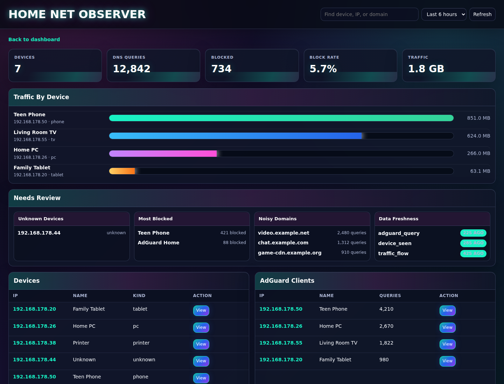
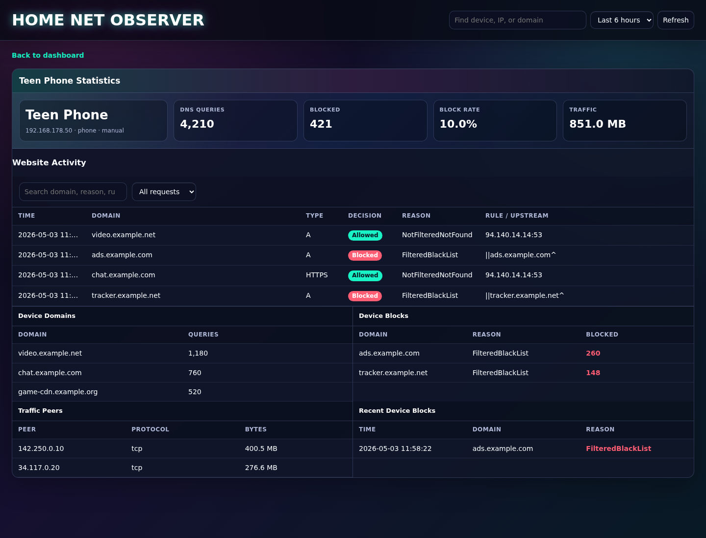

# Home Net Observer

Home Net Observer is a metadata-only local network monitor for household
networks. It captures packet metadata, summarizes traffic, writes measurements
to InfluxDB, and visualizes the results in the built-in Web UI or Grafana.

The first target setup is a Windows PC with Docker Desktop running the central
InfluxDB/Grafana stack. For full Windows NIC visibility, the collector should
run natively with Npcap. The Docker collector is useful for Linux hosts,
Raspberry Pi, home servers, gateway-style machines, and smoke testing.

## What It Collects

The collector stores metadata only. It does not store packet payloads, website
content, request bodies, cookies, or credentials.

Collected data:

- source and destination IP address
- source and destination MAC address when visible
- active ARP scan responses for devices on the local subnet
- friendly names from DHCP, local DNS/mDNS-style DNS answers, or manual labels
- reverse DNS hostname when available
- DNS query name and query type when visible
- protocol
- packet counts
- byte counts
- collector name
- timestamps

InfluxDB measurements:

- `device_seen`
- `traffic_flow`
- `dns_query`
- `adguard_query`

## Web UI

The built-in Web UI is the recommended day-to-day view for household monitoring.
It reads from InfluxDB and shows:

- household devices from `device_seen`
- AdGuard clients and query counts
- top requested domains
- top blocked domains
- recent blocked requests
- top network talkers by observed traffic bytes
- click-through device history for domains, blocks, and traffic peers
- per-device website activity with allowed/blocked status, AdGuard reason,
  rule/upstream, and search filters
- per-device profile header with identity, DNS query count, blocked count, block
  rate, and observed traffic
- `Needs Review` insights for unknown devices, most-blocked devices, noisy
  domains, and data freshness
- `Quick Find` search for devices, IP addresses, and domains

Dashboard overview:



Device detail view:



Start it with the central stack:

```bash
docker compose up -d influxdb webui
```

Open:

```text
http://localhost:8088
```

The host port is controlled by:

```text
WEBUI_HTTP_PORT=8088
```

To keep Docker/internal addresses out of the household view, set your LAN
prefix:

```text
WEBUI_LAN_PREFIX=192.168.178.
```

Leave `WEBUI_LAN_PREFIX` empty if you want to show every IP stored in InfluxDB.

## Naming Devices

Some devices advertise useful names through DHCP or local DNS traffic. The
collector now listens for those names and writes them into `device_seen` as:

- `name`
- `source`
- `kind`

Name sources:

- `manual`: from your local MAC label file
- `dhcp`: learned from DHCP hostname option when visible
- `dns`: learned from reverse DNS or local DNS answers when visible

Manual labels are the most reliable way to make the dashboard readable. Labels
can use either a MAC address or a stable local IP address. Copy the example file
and edit it with your real devices:

```bash
cp config/devices.example.csv config/devices.csv
```

Format:

```csv
id,name,kind
aa:bb:cc:dd:ee:ff,Living room TV,tv
11:22:33:44:55:66,Work laptop,laptop
192.168.178.51,Teen tablet,tablet
```

The file is mounted into the collector container at:

```text
/etc/home-net-observer/devices.csv
```

Native collector runs can point to a local file:

```powershell
$env:COLLECTOR_DEVICE_LABELS="C:\path\to\devices.csv"
```

## AdGuard Home

Your AdGuard Home instance is configured as:

```text
ADGUARD_BASE_URL=http://192.168.178.61
```

Use the base URL without the browser `#` fragment. The project will use
AdGuard's local API under `/control`, such as:

```text
GET /control/status
GET /control/querylog
```

The API requires your AdGuard admin username and password:

```text
ADGUARD_USERNAME=
ADGUARD_PASSWORD=
```

Keep real credentials only in `.env`; do not commit them.

When enabled, the collector polls AdGuard every `ADGUARD_POLL_INTERVAL` and
writes query-log entries to InfluxDB as `adguard_query`.

Useful query:

```bash
docker compose exec -T influxdb influx query \
  --org home \
  --token change-me-token \
  'from(bucket:"network") |> range(start:-1h) |> filter(fn:(r)=>r._measurement == "adguard_query") |> limit(n:20)'
```

The overview dashboard includes:

- `AdGuard DNS Queries`
- `AdGuard Blocked Domains`

## Repository Layout

```text
.
├── collector/                  # Go packet metadata collector
├── webui/                      # Go household monitoring web interface
├── dashboards/                 # Grafana dashboard JSON
├── docs/                       # Architecture and roadmap notes
├── provisioning/grafana/       # Grafana datasource and dashboard provisioning
├── docker-compose.yml          # InfluxDB, Web UI, Grafana, optional collector
├── docker-compose.dockge.yml   # Dockge/home-server deployment
├── .env.example                # Example runtime configuration
├── .env.dockge.example         # Dockge environment template
├── Makefile                    # Repeatable local checks
└── README.md
```

## Requirements

For the central stack:

- Docker Desktop or Docker Engine
- Docker Compose

For native Windows packet capture:

- Go 1.23 or newer
- Npcap installed from `https://npcap.com/`
- A terminal with permission to capture packets

For Linux packet capture:

- Docker Engine or native Go
- `libpcap`
- `NET_RAW`/`NET_ADMIN` capability when running in Docker

## Quick Start

From the project root:

```bash
cd /home/sbera/git/personal/home-net-observer
cp .env.example .env
docker compose up -d influxdb grafana
```

For the Web UI:

```bash
docker compose up -d influxdb webui
```

Open:

```text
http://localhost:8088
```

Open Grafana:

```text
http://localhost:3000
```

Default development login from `.env.example`:

```text
admin / admin
```

InfluxDB is available at:

```text
http://localhost:8086
```

Development InfluxDB defaults:

```text
org: home
bucket: network
token: change-me-token
```

Before publishing or using this beyond a local test, change all values in `.env`.

## Run The Collector In Docker

Docker collector mode is best for Linux hosts or for smoke testing. The default
example interface is:

```text
COLLECTOR_INTERFACE=any
```

Start the collector:

```bash
docker compose --profile collector up -d collector
```

Check that it started:

```bash
docker compose logs --tail 50 collector
```

Expected log:

```text
collector started collector=home-pc interface=any influx=http://influxdb:8086
```

List capture interfaces visible inside the collector image:

```bash
docker run --rm home-net-observer-collector:dev -list-interfaces
```

On Docker Desktop for Windows, this container sees Docker networking rather than
the full physical household network. That is expected.

Active LAN scanning is enabled by default, but it cannot run on the `any`
pseudo-interface. For a real Linux host or Raspberry Pi, set a concrete capture
interface:

```text
COLLECTOR_INTERFACE=eth0
COLLECTOR_SCAN_ENABLED=true
COLLECTOR_SCAN_INTERVAL=5m
COLLECTOR_SCAN_CIDR=
COLLECTOR_SCAN_MAX_HOSTS=1024
COLLECTOR_DEVICE_LABELS=/etc/home-net-observer/devices.csv
```

If `COLLECTOR_SCAN_CIDR` is empty, the collector scans the IPv4 subnet assigned
to the capture interface. You can set it explicitly, for example:

```text
COLLECTOR_SCAN_CIDR=192.168.1.0/24
```

To let the Docker collector see the real host NIC on Linux, run it with the
host-network override:

```bash
docker compose -f docker-compose.yml -f docker-compose.collector-host.yml --profile collector up -d collector
```

In host-network mode the collector reaches local InfluxDB through
`http://127.0.0.1:8086` by default. Override it when sending data to a different
central server:

```text
COLLECTOR_HOST_INFLUX_URL=http://CENTRAL_SERVER_IP:8086
```

## Run The Collector Natively On Windows

This is the recommended path for testing real traffic from a Windows PC.

1. Start InfluxDB and Grafana with Docker:

   ```powershell
   docker compose up -d influxdb grafana
   ```

2. Install Npcap from:

   ```text
   https://npcap.com/
   ```

3. List interfaces:

   ```powershell
   cd C:\path\to\home-net-observer
   go run .\collector\cmd\collector -list-interfaces
   ```

4. Pick the active Wi-Fi or Ethernet interface name.

5. Run the collector:

   ```powershell
   $env:COLLECTOR_NAME="windows-pc"
   $env:COLLECTOR_INTERFACE="\Device\NPF_{YOUR-INTERFACE-ID}"
   $env:COLLECTOR_INFLUX_URL="http://localhost:8086"
   $env:COLLECTOR_PROMISCUOUS="true"
   $env:COLLECTOR_SCAN_ENABLED="true"
   $env:COLLECTOR_SCAN_INTERVAL="5m"
   $env:COLLECTOR_SCAN_CIDR="192.168.1.0/24"
   $env:COLLECTOR_DEVICE_LABELS="C:\path\to\devices.csv"
   $env:INFLUXDB_TOKEN="change-me-token"
   $env:INFLUXDB_ORG="home"
   $env:INFLUXDB_BUCKET="network"
   go run .\collector\cmd\collector
   ```

6. Browse a few sites or run DNS lookups.

7. Refresh Grafana.

## Device Inventory And Drill-Down

The overview dashboard contains a `Devices Seen` table. Devices arrive from two
sources:

- passive traffic observed by the collector
- active ARP scans of the local subnet

Click a row in the `Devices Seen` table to open the device detail dashboard.
The detail dashboard is filtered by `device_ip` and shows:

- traffic rate involving that device
- top conversations by source IP, destination IP, and protocol
- DNS queries from that device when DNS packets are visible
- latest known IP, MAC, friendly name, hostname, kind, source, and collector

Grafana provisions both dashboards automatically from `dashboards/`.

## Central Home Server Mode

Run the storage and dashboard stack on one central machine:

```bash
docker compose up -d influxdb webui grafana
```

On each collector device, point to the central server:

```text
COLLECTOR_INFLUX_URL=http://CENTRAL_SERVER_IP:8086
INFLUXDB_TOKEN=change-me-token
INFLUXDB_ORG=home
INFLUXDB_BUCKET=network
COLLECTOR_NAME=living-room-pc
```

Then run the collector natively or in Docker depending on the host.

## Dockge Home Server Mode

For Dockge, use the dedicated compose file:

```text
docker-compose.dockge.yml
```

It runs:

- InfluxDB
- Web UI
- collector with host networking for LAN visibility

Deployment notes are in:

```text
docs/DOCKGE.md
```

Open the Web UI from another device on the home network:

```text
http://HOME_SERVER_IP:8088
```

## Test Plan

Use these checks in order.

### 1. Validate Compose

```bash
docker compose --env-file .env.example config
```

Expected result: Compose prints the resolved configuration without errors.

Shortcut:

```bash
make compose-config
```

### 2. Build Collector Image

```bash
docker build -f collector/Dockerfile -t home-net-observer-collector:dev .
```

Shortcut:

```bash
make collector-build
```

Expected result: image builds successfully.

### 3. Run Go Tests

The test target installs `libpcap-dev` inside a temporary Go container and runs
the collector tests.

```bash
make collector-test
```

Expected result:

```text
ok  	github.com/sberaconnects/home-net-observer/collector/cmd/collector
```

The current unit test verifies:

- synthetic DNS packets produce `dns_query` metadata
- observed packets produce `device_seen` metadata
- flushed packet summaries produce `traffic_flow` metadata
- scan helper logic limits active scans to safe local ranges

### 4. Start The Stack

```bash
docker compose up -d influxdb grafana
docker compose ps
```

Expected result:

```text
hno-influxdb   Up   8086
hno-grafana    Up   3000
```

### 5. Check Grafana Provisioning

Inspect Grafana logs:

```bash
docker compose logs --tail 100 grafana
```

Expected useful lines:

```text
inserting datasource from configuration name="Home Network InfluxDB"
finished to provision dashboards
```

Then open:

```text
http://localhost:3000
```

Look for the `Home Net Observer` dashboard under the `Home Network` folder.

### 5b. Check The Web UI

Start the Web UI:

```bash
docker compose up -d webui
```

Check health:

```bash
curl http://localhost:8088/healthz
```

Expected result:

```text
ok
```

Open:

```text
http://localhost:8088
```

### 6. Start Collector

```bash
docker compose --profile collector up -d collector
docker compose logs --tail 50 collector
```

Expected log:

```text
collector started
```

### 7. Confirm InfluxDB Has Data

Query measurement counts:

```bash
docker compose exec -T influxdb influx query \
  --org home \
  --token change-me-token \
  'from(bucket:"network") |> range(start:-10m) |> group(columns:["_measurement"]) |> count()'
```

Expected result after the Docker collector runs:

- `device_seen`
- `traffic_flow`

`dns_query` appears when DNS packets are visible to the capture interface. In
Docker Desktop and some Docker Linux setups, DNS may go through Docker's embedded
resolver path and may not be visible to the collector interface. Native Windows
with Npcap, Linux host capture, or gateway capture is the better DNS test.

### 8. Query A Specific Measurement

Traffic:

```bash
docker compose exec -T influxdb influx query \
  --org home \
  --token change-me-token \
  'from(bucket:"network") |> range(start:-10m) |> filter(fn:(r)=>r._measurement == "traffic_flow") |> limit(n:10)'
```

Devices:

```bash
docker compose exec -T influxdb influx query \
  --org home \
  --token change-me-token \
  'from(bucket:"network") |> range(start:-10m) |> filter(fn:(r)=>r._measurement == "device_seen") |> limit(n:10)'
```

DNS:

```bash
docker compose exec -T influxdb influx query \
  --org home \
  --token change-me-token \
  'from(bucket:"network") |> range(start:-10m) |> filter(fn:(r)=>r._measurement == "dns_query") |> limit(n:10)'
```

## Current Tested Result

The project has been tested locally with Docker.

Passing checks:

- Compose configuration validates.
- InfluxDB starts and initializes org `home` and bucket `network`.
- Grafana starts and provisions the InfluxDB datasource.
- Grafana provisions the `Home Net Observer` dashboard.
- Web UI starts on `http://localhost:8088`.
- Web UI API returns LAN-filtered dashboard data from InfluxDB.
- Collector Docker image builds successfully.
- Collector starts with interface `any`.
- Collector writes `device_seen` data to InfluxDB.
- Collector writes `traffic_flow` data to InfluxDB.
- Go unit tests pass for DNS extraction, device metadata, and flow flushing.

Known limitation from this Docker smoke test:

- DNS packets were not visible from the Docker collector interface in this
  environment. This is expected in some Docker setups and should be tested with
  native Windows/Npcap or a host/gateway capture point.

## Testing Multiple Devices

For actual household device discovery, test on a host that can access the real
LAN interface.

On Windows:

1. Run InfluxDB and Grafana with Docker Desktop.
2. Run the collector natively with Npcap.
3. Set `COLLECTOR_INTERFACE` to the real Wi-Fi or Ethernet Npcap interface.
4. Set `COLLECTOR_SCAN_CIDR` to your home subnet, such as `192.168.1.0/24`.
5. Wait one scan interval or restart the collector to scan immediately.
6. Open the `Home Net Observer` dashboard.
7. Click a device in `Devices Seen` to open its history.

On Linux or Raspberry Pi:

```bash
COLLECTOR_INTERFACE=eth0
COLLECTOR_SCAN_ENABLED=true
COLLECTOR_SCAN_CIDR=192.168.1.0/24
docker compose -f docker-compose.yml -f docker-compose.collector-host.yml --profile collector up -d collector
```

The collector sends ARP probes only inside the configured subnet and caps scan
size with `COLLECTOR_SCAN_MAX_HOSTS`.

## Common Commands

Start central stack:

```bash
docker compose up -d influxdb grafana
```

Start collector too:

```bash
docker compose --profile collector up -d collector
```

Show status:

```bash
docker compose ps
```

Show logs:

```bash
docker compose logs -f collector
docker compose logs -f grafana
docker compose logs -f influxdb
```

Stop services:

```bash
docker compose --profile collector stop
```

Stop and remove containers while keeping volumes:

```bash
docker compose --profile collector down
```

## Troubleshooting

### Grafana Opens But Dashboard Is Empty

Check whether the collector is running:

```bash
docker compose ps
docker compose logs --tail 50 collector
```

Then query InfluxDB:

```bash
docker compose exec -T influxdb influx query \
  --org home \
  --token change-me-token \
  'from(bucket:"network") |> range(start:-10m) |> group(columns:["_measurement"]) |> count()'
```

### InfluxDB Query Says Unauthorized

Make sure the token matches `.env`:

```text
INFLUXDB_TOKEN=change-me-token
```

If you changed `.env` after the InfluxDB volume was initialized, recreate the
volume or update the token inside InfluxDB.

### Collector Cannot Open Interface

List interfaces:

```bash
docker run --rm home-net-observer-collector:dev -list-interfaces
```

Set `COLLECTOR_INTERFACE` in `.env` to one of the listed names.

For Windows native capture, install Npcap and run the interface listing command
from PowerShell.

### Docker Collector Does Not See Household Traffic

This is normal on Docker Desktop for Windows. The collector container usually
sees the Docker VM network, not the full physical LAN. Use the native Windows
collector with Npcap for real PC-level capture.

For whole-house visibility, run the collector on a gateway, firewall, Linux
bridge, Raspberry Pi bridge, or mirrored switch port.

## Security Notes

- Change `.env` secrets before publishing or long-running use.
- Do not expose InfluxDB or Grafana directly to the internet.
- Treat traffic metadata as sensitive household data.
- Keep metadata-only capture as the default behavior.

## Roadmap

- AdGuard Home query-log ingestion for household-wide monitoring and blocking.
- Dockge-ready home-server deployment with AdGuard Home, InfluxDB, Grafana, and
  Home Net Observer.
- Native Windows binary packaging.
- Better hostname enrichment from mDNS, DHCP leases, and NetBIOS.
- Device labels.
- Dashboard variables for collector and device.
- Alerts for unusual traffic spikes.
- Optional domain allowlist/denylist dashboards.
- Gateway/Raspberry Pi deployment guide.
